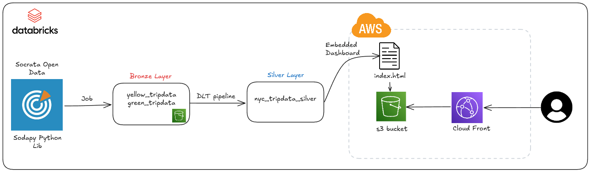
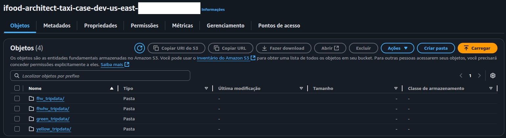
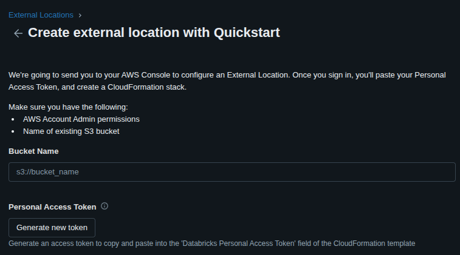

# 🚕 iFood Data Architect Taxi Case
Repositório criado com o objetivo de armazenar a solução técnica para o **Case de Arquiteto de Dados no iFood**.

## Contexto
O case consiste em **armazenar e disponibilizar os dados de Janeiro a Maio de 2023**, os quais podem ser obtidos através do site oficial da agência reguladora de táxis da cidade de **Nova York (NYC Taxi & Limousine Commission - TLC)**.

## Diagrama da solução proposta



## Solução

### Obtenção dos dados
Como **não foi identificada uma API oficial** para ingestão automatizada, optou-se pelo download manual **dos arquivos** `.parquet` referentes ao período de interesse.

No total, foram baixados 20 arquivos, referentes aos seguintes tipos de dados:
- **yellow_tripdata**
- **green_tripdata**
- **fhv_tripdata**
- **fhvhv_tripdata**

Os arquivos foram organizados em **pastas separadas** de acordo com o tipo de dado de origem.

### Storage: Bucket no S3
O armazenamento foi feito em um **bucket no Amazon S3**, criado via **Terraform**. 

Para envio dos arquivos locais ao bucket, utilizou-se o seguinte comando com **AWS CLI**:

`aws s3 sync ../tripdata s3://ifood-architect-taxi-case-dev-us-east-2-{AWS_ACCOUNT_ID} --profile dev`

#### Print do Bucket no S3  



### Bronze Layer
Para ingestão dos dados no **Databricks Free Edition**, foi necessário configurar uma **External Location** que permitisse o consumo direto dos dados no S3.

Configuração inicial via Quickstart:



#### Segurança
Foi criado um scope e um secret para armazenar o **AWS Account ID**, utilizando o **Databricks CLI**:

```
databricks secrets create-scope db-scope
databricks secrets put-secret db-scope aws_account_id --string-value={AWS_ACCOUNT_ID}
```

A ingestão foi feita via Autoloader para garantir um processo incremental e resiliente. O notebook responsável pela carga está disponível em: [Script](.src/ingestion_data_into_bronze_layer.ipynb).

### Silver Layer
Na camada Silver, os dados foram processados para:

- Manter apenas as colunas relevantes;
- Garantir consistência de partições.

O notebook responsável está em: [Script](.src/load_data_into_silver_layer.ipynb).

## Perguntas Case
1. Qual a média de valor total (total\_amount) recebido em um mês considerando todos os yellow táxis da frota?

    Ou seja a média é de aproximadamente **$90,120,269.65**.

2. Qual a média de passageiros (passenger\_count) por cada hora do dia que pegaram táxi no mês de maio considerando todos os táxis da frota?

    | hour | average_passenger |
    | ---- | ------ |
    |00:00 |	1.41|
    |01:00 |	1.42|
    |02:00 |	1.44|
    |03:00 |	1.43|
    |04:00 |	1.39|
    |05:00 |	1.26|
    |06:00 |	1.24|
    |07:00 |	1.25|
    |08:00 |	1.26|
    |09:00 |	1.28|
    |10:00 |	1.32|
    |11:00 |	1.33|
    |12:00 |	1.35|
    |13:00 |	1.35|
    |14:00 |	1.36|
    |15:00 |	1.37|
    |16:00 |	1.37|
    |17:00 |	1.36|
    |18:00 |	1.36|
    |19:00 |	1.37|
    |20:00 |	1.38|
    |21:00 |	1.40|
    |22:00 |	1.41|
    |23:00 |	1.41|

## Tecnologias
- Pyspark
- SQL
- Terraform
- AWS (S3 + CLI)
- Databricks (Autoloader, Delta Lake, CLI, Secrets)
- Git
- Jira

## Conclusão
A solução proposta:

- Centraliza os dados brutos em uma camada Bronze no S3;
- Estrutura os dados limpos em uma camada Silver no Databricks;
- Automatiza a ingestão com uso de ferramentas modernas como Terraform, Databricks Autoloader e AWS CLI.